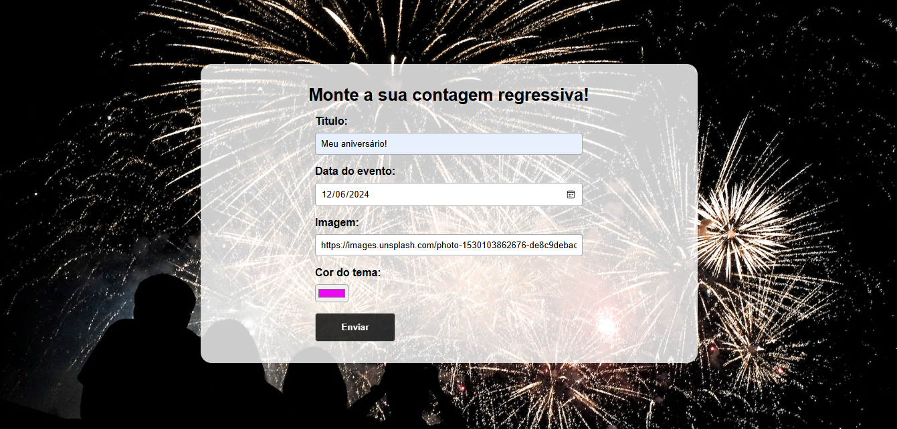

# Projeto: Contador regressivo
A proposta deste contador é personalizá-lo com diversas informações: 
- Título do evento.
- Data do evento, é a data limite que é o parâmetro para a contagem regressiva.
- Uma imagem que pode ser capturada dinamicamente por meio de uma URL.
- Cor do tema, é a cor que define os principais elementos do contador.

  
Após preencher os campos da página Home, os dados são transportados através de "Context API" e o contador é exibido.  
 

Além do React, o projeto apresenta funcionalidades desenvolvidas com Hooks, React Router e Context API. 

### TECNOLOGIAS:
- HTML
- CSS
- REACT
- GIT/GITHUB
